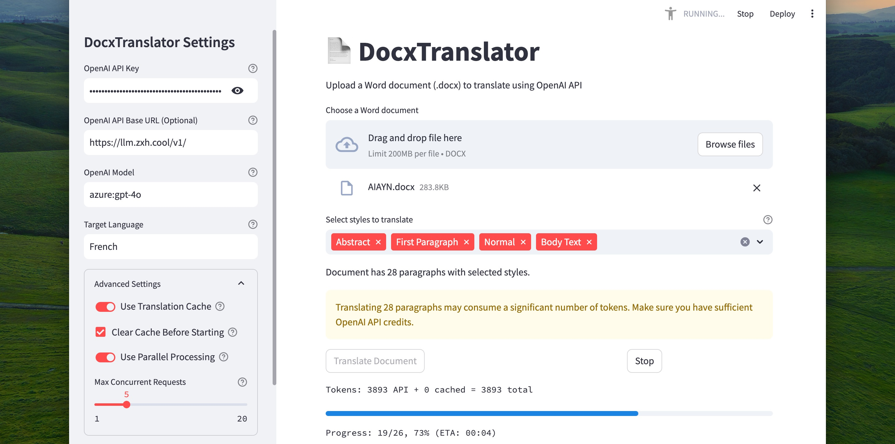
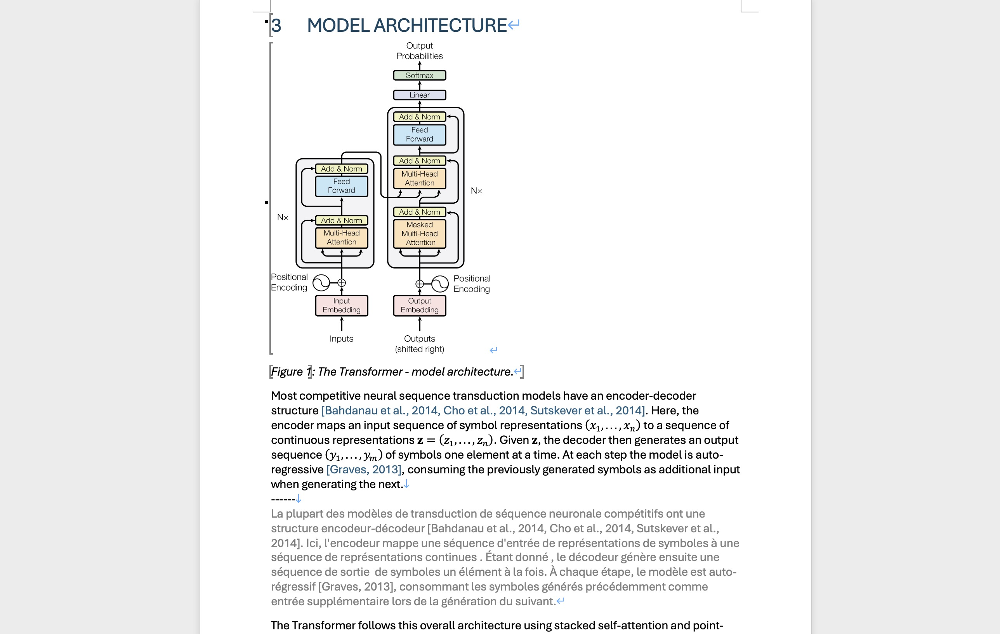

<p align="center"> 
  <a href="/README.md">English</a> 
  ·
  <a href="/docs/README_fr.md">Français</a>
  ·
  <a href="/docs/README_de.md">Deutsch</a>
  ·
  <a href="/docs/README_zh-cn.md">简体中文</a>  
  ·
  <a href="/docs/README_zh-tw.md">繁體中文</a>
  ·
  <a href="/docs/README_kr.md">한국어</a> 
  ·
  <a href="/docs/README_pt.md">Português</a>
</p>

<p align="center">

</p>

> Un coding vibrant et authentique alimente ce projet impressionnant. 

DocxTranslator est un outil pour traduire des documents Word (.docx) utilisant l'API d'OpenAI. Il préserve la mise en forme du document original et ajoute des traductions sous chaque paragraphe.

<p align="center">
  <a href="https://pypi.org/project/docx-translator/">
    
  </a>
  <a href="https://hub.docker.com/r/johndope/docx-translator">
    
  </a>
  <a href="https://github.com/john-theo/docx-translator">
    
  </a>
  <a href="https://github.com/john-theo/docx-translator">
    
  </a>
</p>




> ⤷ Si ces images ne s'affichent pas, vous pouvez [les voir sur Github](https://github.com/john-theo/docx-translator)

## ✨ Fonctionnalités

- 🔄 Traduire des documents Word (.docx) avec les modèles OpenAI GPT
- 🎨 Préserver la mise en forme et la structure du document
- 🌐 Ajouter des traductions directement sous le texte original
- 💻 Interface en ligne de commande pour une intégration facile dans des scripts
- 🌍 Interface web propulsée par Streamlit
- 💾 Mise en cache des traductions pour éviter les appels API redondants
- ⚡ Traitement parallèle pour une traduction plus rapide
- 🔧 Support pour des points de terminaison API OpenAI personnalisés

## 📦 Installation

### Via Pip
```bash
pip install docx-translator
```

### Via Docker
Vous pouvez utiliser l'image Docker préconstruite pour commencer immédiatement :

```bash
# Télécharger l'image préconstruite
docker pull johndope/docx-translator:latest

# Exécuter avec votre clé API
docker run -p 8501:8501 -e OPENAI_API_KEY=votre-clé-api johndope/docx-translator
```

## 🖥️ Utilisation en Ligne de Commande

Après l'installation, vous pouvez utiliser la commande `dt` pour traduire des documents :

```bash
# Utilisation basique
dt translate document.docx Espagnol

# Spécifier le fichier de sortie
dt translate document.docx Français --output document_traduit.docx

# Traduire des styles de paragraphe spécifiques
dt translate document.docx Allemand --styles "Normal,Titre 1,Paragraphe de liste"

# Utiliser un modèle différent
dt translate document.docx Japonais --model gpt-4o

# Désactiver la mise en cache
dt translate document.docx Chinois --no-cache

# Effacer le cache pour une langue avant la traduction
dt translate document.docx Italien --clear-cache

# Traiter séquentiellement (au lieu de parallèlement)
dt translate document.docx Russe --sequential

# Afficher les logs détaillés
dt translate document.docx Portugais --verbose
```

### 🧹 Effacer les Caches de Traduction

```bash
dt clear-caches
```

### 🚀 Lancer l'Interface Web

```bash
dt serve
```

## 🐳 Utilisation avec Docker

Vous pouvez exécuter DocxTranslator en utilisant Docker :

### Option 1: Utiliser l'image préconstruite (recommandée)

```bash
# Télécharger l'image préconstruite
docker pull johndope/docx-translator:latest

# Exécuter avec votre clé API
docker run -p 8501:8501 -e OPENAI_API_KEY=votre-clé-api johndope/docx-translator
```

### Option 2: Utiliser docker-compose

```bash
# Créer un fichier .env avec votre clé API OpenAI et d'autres paramètres
echo "OPENAI_API_KEY=votre-clé-api" > .env

# Construire et démarrer le conteneur Docker
docker-compose up -d

# Accéder à l'interface web à http://localhost:8501
```

La configuration Docker :
- 📂 Utilise le package installé directement via la commande `dt`
- 💽 Monte un répertoire de cache pour des traductions persistantes
- 📁 Monte un répertoire de données pour partager des documents avec le conteneur

## 🔑 Variables d'Environnement

Vous pouvez définir les variables d'environnement suivantes (ou utiliser un fichier `.env`) :

- `OPENAI_API_KEY` : Votre clé API OpenAI
- `OPENAI_BASE_URL` : URL de base personnalisée pour l'API OpenAI (optionnel)
- `OPENAI_MODEL` : Le modèle à utiliser (par défaut : gpt-4-turbo)
- `OPENAI_MAX_CONCURRENT` : Nombre maximum de requêtes simultanées (par défaut : 5)
- `TARGET_LANGUAGE` : Langue cible par défaut (par défaut : Espagnol)
- `DOCX_TRANSLATOR_CACHE_DIR` : Répertoire de cache personnalisé

## 🐍 API Python

Vous pouvez également utiliser DocxTranslator par programmation :

```python
from pathlib import Path
from docx_translator.translator import setup_openai_client, process_document

# Configurer le client OpenAI
client = setup_openai_client(api_key="votre-clé-api")

# Traduire le document
process_document(
   input_file=Path("document.docx"),
   output_file=Path("document_traduit.docx"),
   target_language="Français",
   target_styles=["Normal", "Titre 1"],
   openai_client=client,
   use_cache=True,
   parallel=True,
   max_concurrent=5
)
```

## 🌐 Interface Web

DocxTranslator inclut une interface web propulsée par Streamlit. Pour la démarrer :

```bash
dt serve
```

Cela lancera un serveur web local où vous pourrez :
- 📤 Téléverser des documents Word
- 🎯 Sélectionner quels styles de paragraphe traduire
- ⚙️ Configurer les paramètres de l'API OpenAI
- 🚀 Démarrer des traductions avec suivi de progression
- 📥 Télécharger le document traduit

## 📜 Licence

MIT 