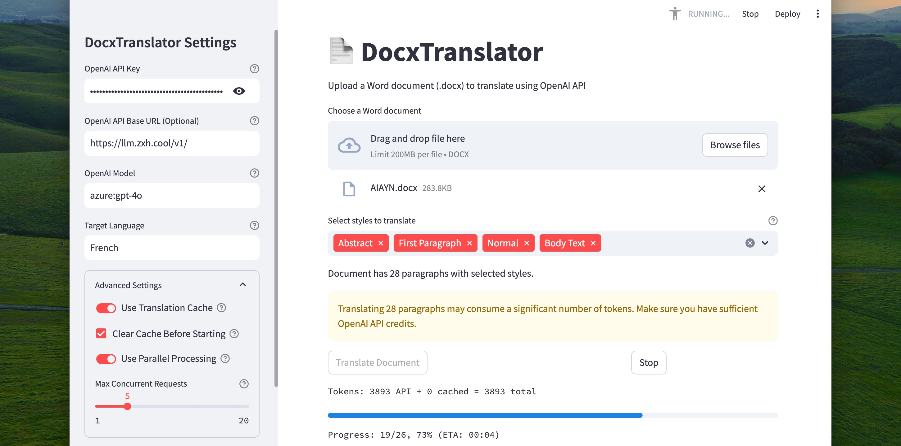
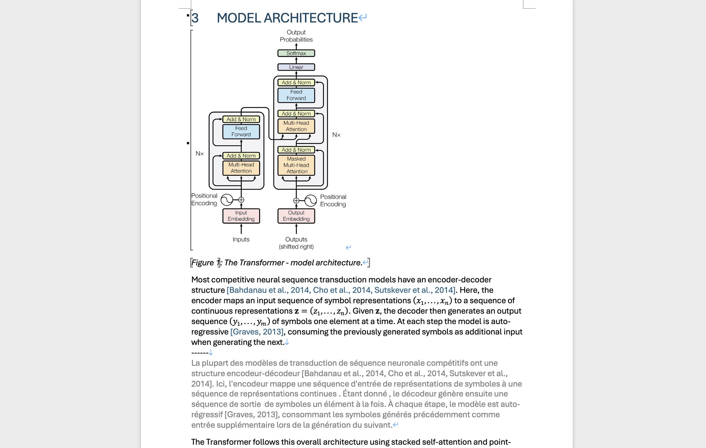

<p align="center"> 
  <a href="/README.md">English</a> 
  ·
  <a href="/docs/README_fr.md">Français</a>
  ·
  <a href="/docs/README_de.md">Deutsch</a>
  ·
  <a href="/docs/README_zh-cn.md">简体中文</a>  
  ·
  <a href="/docs/README_zh-tw.md">繁體中文</a>
  ·
  <a href="/docs/README_kr.md">한국어</a> 
  ·
  <a href="/docs/README_pt.md">Português</a>
</p>

<p align="center">

</p>

> 純粹、原汁原味的氛圍編碼驅動著這個龐大專案的運作。 

DocxTranslator 是一個使用 OpenAI API 翻譯 Word 文件 (.docx) 的工具。它保留原始文件格式並在每個段落下方添加翻譯。

<p align="center">
  <a href="https://pypi.org/project/docx-translator/">
    
  </a>
  <a href="https://hub.docker.com/r/johndope/docx-translator">
    
  </a>
  <a href="https://github.com/john-theo/docx-translator">
    
  </a>
  <a href="https://github.com/john-theo/docx-translator">
    
  </a>
</p>




> ⤷ 如果這些圖片無法顯示，您可以[在 Github 上查看它們](https://github.com/john-theo/docx-translator)

## ✨ 特性

- 🔄 使用 OpenAI GPT 模型翻譯 Word 文件 (.docx)
- 🎨 保留文件格式和結構
- 🌐 在原文下方直接添加翻譯
- 💻 命令行界面，易於整合到腳本中
- 🌍 由 Streamlit 提供支援的 Web 界面
- 💾 翻譯快取，避免重複的 API 呼叫
- ⚡ 平行處理，實現更快的翻譯
- 🔧 支援自定義 OpenAI API 端點

## 📦 安裝

### 透過 Pip
```bash
pip install docx-translator
```

### 透過 Docker
您可以使用預構建的 Docker 映像立即開始使用：

```bash
# 拉取預構建映像
docker pull johndope/docx-translator:latest

# 使用您的 API 金鑰運行
docker run -p 8501:8501 -e OPENAI_API_KEY=您的API金鑰 johndope/docx-translator
```

## 🖥️ 命令行使用

安裝後，您可以使用 `dt` 命令翻譯文件：

```bash
# 基本用法
dt translate document.docx 西班牙語

# 指定輸出文件
dt translate document.docx 法語 --output translated_document.docx

# 翻譯特定段落樣式
dt translate document.docx 德語 --styles "Normal,Heading 1,List Paragraph"

# 使用不同的模型
dt translate document.docx 日語 --model gpt-4o

# 禁用快取
dt translate document.docx 中文 --no-cache

# 在翻譯前清除某語言的快取
dt translate document.docx 義大利語 --clear-cache

# 順序處理（而非平行）
dt translate document.docx 俄語 --sequential

# 顯示詳細日誌
dt translate document.docx 葡萄牙語 --verbose
```

### 🧹 清除翻譯快取

```bash
dt clear-caches
```

### 🚀 啟動 Web 界面

```bash
dt serve
```

## 🐳 Docker 使用

您可以使用 Docker 運行 DocxTranslator：

### 選項 1：使用預構建映像（推薦）

```bash
# 拉取預構建映像
docker pull johndope/docx-translator:latest

# 使用您的 API 金鑰運行
docker run -p 8501:8501 -e OPENAI_API_KEY=您的API金鑰 johndope/docx-translator
```

### 選項 2：使用 docker-compose

```bash
# 創建一個包含 OpenAI API 金鑰和其他設置的 .env 文件
echo "OPENAI_API_KEY=您的API金鑰" > .env

# 構建並啟動 Docker 容器
docker-compose up -d

# 在 http://localhost:8501 訪問 Web 界面
```

Docker 設置：
- 📂 透過 `dt` 命令直接使用已安裝的包
- 💽 掛載快取目錄以保留翻譯結果
- 📁 掛載資料目錄，用於與容器共享文件

## 🔑 環境變數

您可以設置以下環境變數（或使用 `.env` 文件）：

- `OPENAI_API_KEY`：您的 OpenAI API 金鑰
- `OPENAI_BASE_URL`：自定義 OpenAI API 基礎 URL（可選）
- `OPENAI_MODEL`：要使用的模型（預設：gpt-4-turbo）
- `OPENAI_MAX_CONCURRENT`：最大並發請求數（預設：5）
- `TARGET_LANGUAGE`：預設目標語言（預設：西班牙語）
- `DOCX_TRANSLATOR_CACHE_DIR`：自定義快取目錄

## 🐍 Python API

您也可以以程式設計方式使用 DocxTranslator：

```python
from pathlib import Path
from docx_translator.translator import setup_openai_client, process_document

# 設置 OpenAI 客戶端
client = setup_openai_client(api_key="您的API金鑰")

# 翻譯文件
process_document(
   input_file=Path("document.docx"),
   output_file=Path("translated_document.docx"),
   target_language="繁體中文",
   target_styles=["Normal", "Heading 1"],
   openai_client=client,
   use_cache=True,
   parallel=True,
   max_concurrent=5
)
```

## 🌐 Web 界面

DocxTranslator 包含一個由 Streamlit 提供支援的 Web 界面。要啟動它：

```bash
dt serve
```

這將啟動一個本地 Web 伺服器，您可以：
- 📤 上傳 Word 文件
- 🎯 選擇要翻譯的段落樣式
- ⚙️ 配置 OpenAI API 設置
- 🚀 開始翻譯並跟踪進度
- 📥 下載翻譯後的文件

## 📜 授權條款

MIT 